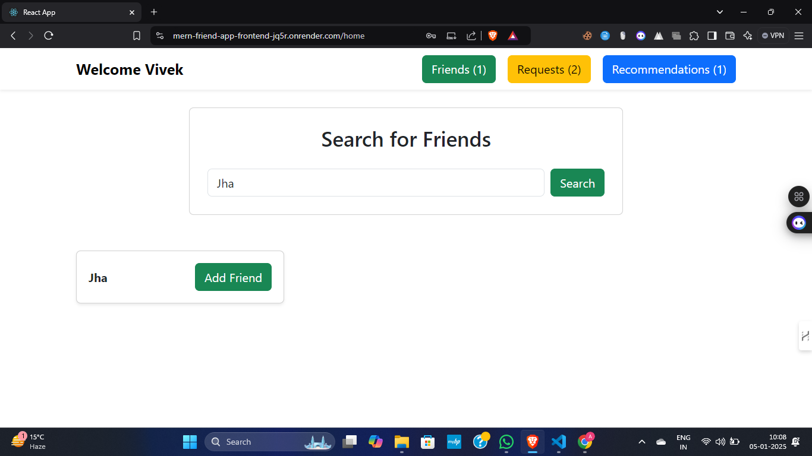

# MERN Stack Friend Finder Application

A full-stack web application built with the MERN stack (MongoDB, Express.js, React.js, Node.js) that enables users to search, add friends, and view friend recommendations based on mutual connections.

---

## Live Demo

You can check out the live demo of the project here: <a href="https://mern-friend-app-frontend-jq5r.onrender.com" target="_blank">Live Demo</a>


## Features

### 1. User Authentication
- **Sign Up**: Users can create an account with a unique username and password.
- **Login**: Secure login functionality using JWT for user sessions.

### 2. Home Page
- **Friend List**: Displays the user's friend list with options to unfriend.
- **Search Bar**: Enables users to search for other registered users.

### 3. Friend Request Management
- **Send Friend Requests**: Users can send requests to other registered users.
- **Manage Friend Requests**: Accept or reject incoming friend requests.

### 4. Friend Recommendations
- **Mutual Connections**: Suggests friends based on the number of mutual friends.
- **Display Recommendations**: Shows a list of recommended friends on the user's dashboard.

---

## Technologies Used
- **Frontend**: React.js
- **Backend**: Node.js with Express.js
- **Database**: MongoDB
- **Authentication**: JSON Web Tokens (JWT)
- **Deployment:** Render (Frontend and Backend)

---

## API Endpoints

### User Authentication
- **POST** `/api/auth/signup`: Register a new user.
- **POST** `/api/auth/login`: Login and receive a JWT.

### Friend Request Management
- **POST** `/api/friend-requests/send`: Send a friend request.
- **POST** `/api/friend-requests/manage`: Accept or reject a friend request.
- **GET** `/api/friend-requests`: Get all incoming friend requests.

### Friends
- **GET** `/api/friends`: Get a list of the user's friends.
- **POST** `/api/friends/remove`: Remove a friend from the user's friend list.

### Friend Recommendations
- **GET** `/api/recommendations`: Get friend recommendations based on mutual connections.

### User Profile
- **GET** `/api/users/:id`: Get the profile of a user by ID.

---

---

## Screenshots





## Setup and Deployment

### Prerequisites
- Node.js and npm installed
- MongoDB setup (MongoDB Atlas)

### Installation

1. Clone the repository:
   ```bash
   git clone https://github.com/Ayushjha298/mern-friend-app.git

2. Install dependencies:
    For the backend:
   ```bash
      cd backend
      npm install
    ```
    For the frontend:
   ```bash
      cd frontend
      npm install
   ```
   
3. Set up environment variables:

    Backend: Create a .env file in the backend folder with
    ```
    MONGO_URI=<your-mongo-db-uri>
    JWT_SECRET=<your-secret-key>
    ```

4. Run the application locally:

    Start the backend:
   ```bash
    cd backend
    npm run dev
    ```
    Start the frontend:
   ```bash
    cd frontend
    npm start
    ```
Deployment

Deployed on Render:

Frontend: [Frontend URL](https://mern-friend-app-frontend-jq5r.onrender.com)
Backend: [Backend URL](https://mern-friend-app-backend-gkrw.onrender.com)

    

## Contact

For any questions or feedback, please reach out to [ayushjha298@gmail.com](mailto:ayushjha298@gmail.com).

